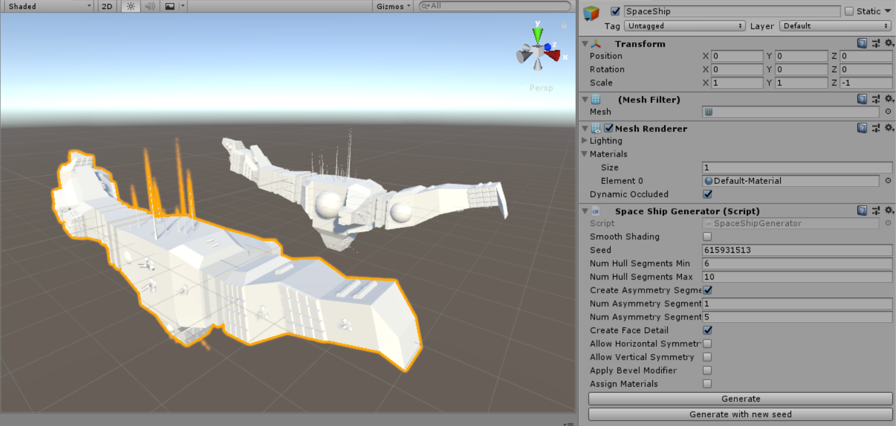

# Unity Procedural spaceship generator

This is a port of a spaceship generator originally written as a blender plugin authored by [Michael Davies](https://github.com/a1studmuffin) which can be found [here](https://github.com/a1studmuffin/SpaceshipGenerator)

## Feature list

- [x] Main spaceship segments extrusion
- [x] Asymmetry segments
- [x] Face details
    - [x] exhaust
    - [x] grid
    - [x] surface antenna
    - [x] weapons
    - [x] sphere to face
    - [x] disc to face
    - [x] cylinders to face
- [ ] horizontal symmetry
- [ ] vertical symmetry
- [ ] bevels
- [ ] materials

This project is licensed under [MIT license](LICENSE.md).